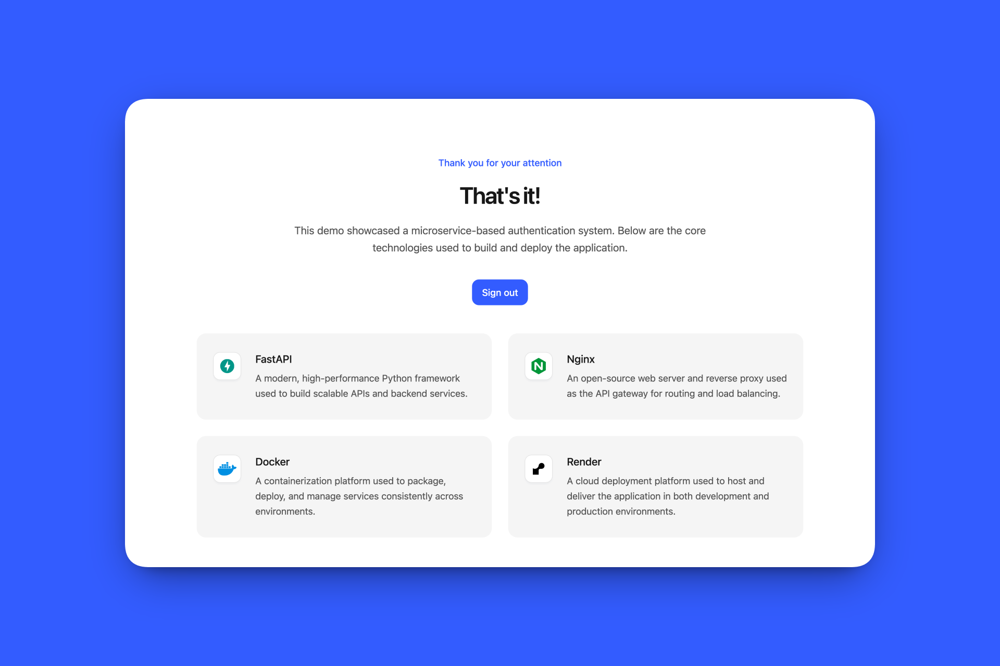

|  |
| - |

# Web Service & AI Interfaces, MSc Course @ uninsubria

This repository contains the seminar presented by me and its demo project for the Web Service & AI Interfaces course at the University of Insubria, part of the MSc in Computer Science.

## Overview

You can easily download the presented seminar and its demo project below, remember to use it responsibly and cite it if you reference it.

## Seminar

| <a href="https://raw.githubusercontent.com/robertovicario/uninsubria-WEB_SERVICES/main/dist/Project_Work.pdf"></a> |
| - |

## Demo

| <a href="https://uninsubria-web-services.onrender.com"></a> |
| - |

## Prerequisites

> [!IMPORTANT]
>
> - Docker
> - Docker Compose

## User Interface (UI)

| <a href="https://uninsubria-web-services.onrender.com"></a> |
| :-: |
| **Demo - Example** |

## Instructions

Usage:

```sh
bash cmd.sh {start|stop|setup|clean}
```

### `setup`

If you haven't built the project yet, you can do so by running:

```sh
bash cmd.sh setup
```

Once the setup process is complete, the project will be accessible at `localhost:8000`.

> [!WARNING]
>
> If this port is already in use, search for all occurrences of `8000` within the project and replace them with your preferred port number. After making these changes, you'll need to rebuild the project for the modifications to take effect.

### `start`

The program will run in debug mode, meaning frontend changes will be rendered upon reload. However, if you make changes to the backend, you will need to restart the program by running:

```sh
bash cmd.sh start
```

### `stop`

To stop the program, simply run:

```sh
bash cmd.sh stop
```

> [!TIP]  
> For a quicker way to stop, use `ctrl + C` to force stop the program.

### `clean`

If you need to clean all containers and their orphaned dependencies, you can run:

```sh
bash cmd.sh clean
```

## Credits

> [!WARNING]
>
> Please use this project responsibly, it was created by me for an exam session that I completed at _University of Insubria_. If you use or reference this project, please cite it as follows:
>
> ```bib
> @misc{vicario2026webservices,
>     author = {R. Vicario},
>     title  = {uninsubria-WEB_SERVICES},
>     year   = {2026},
>     url    = {https://github.com/robertovicario/uninsubria-WEB_SERVICES}
> }
> ```

## License

This project is distributed under [GNU General Public License version 3](https://opensource.org/license/gpl-3-0). You can find the complete text of the license in the project repository.
